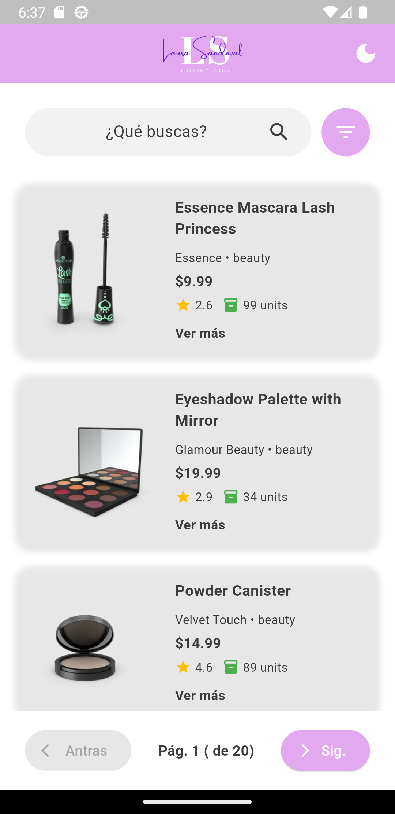
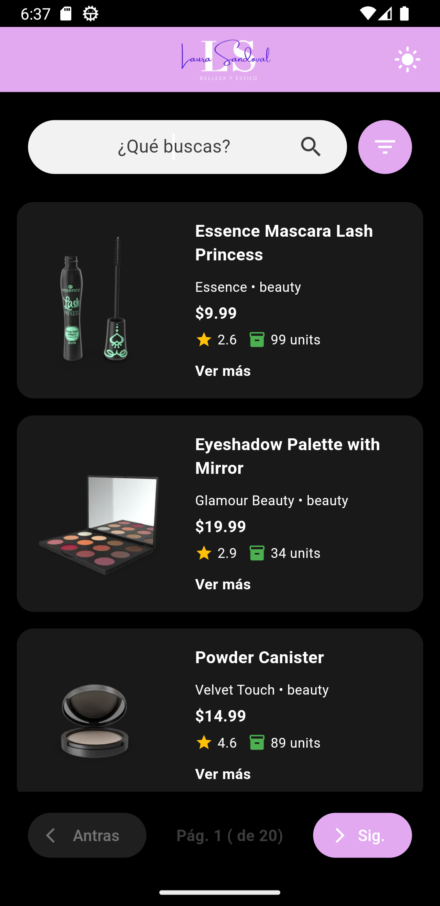
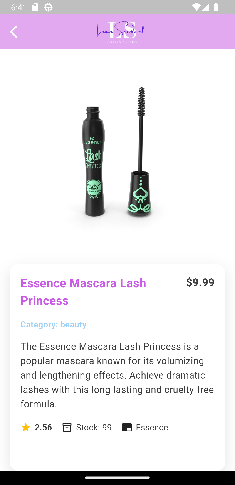

# 📱 Prueba Técnica Flutter - Visualización de Productos

Una aplicación Flutter moderna que consume la **API de DummyJSON** para mostrar productos con **paginación infinita**, **búsqueda en tiempo real** y **modo claro/oscuro**.

---

## 📸 Capturas de Pantalla

| 🌞 Modo Claro | 🌙 Modo Oscuro | 📱 Detalle |
|---------------|----------------|------------|
|  |  |  |
| Vista principal con tema claro | Vista principal con tema oscuro | Detalle completo del producto |

---

## 🚀 Características

### ✅ Requerimientos Principales
- Consumo de API DummyJSON con paginación automática  
- Lista de productos con imagen thumbnail, título, precio y categoría  
- Paginación (carga automática al final del scroll)  
- Pantalla de detalle con información completa y diseño dividido  
- Manejo de estados (carga, error, vacío) con indicadores visuales  
- Arquitectura limpia con separación de responsabilidades  

### 🌟 Extras Implementados
- 🔍 Búsqueda en tiempo real con filtrado instantáneo  
- ⚡ Pull to refresh para recargar datos  
- 📊 Filtros y ordenamiento por precio, nombre y categoría  
- 🌙 Modo claro/oscuro con persistencia local automática  
- 💫 Efecto Shimmer durante la carga de productos  
- 🧪 Test unitario para datasource  

---

## 🛠️ Tecnologías y Dependencias

### Framework y Lenguaje
- Flutter SDK: ^3.5.4  
- Dart: ^3.5.4  

### Manejo de Estado y Arquitectura
- bloc: ^9.0.0 → Gestión de estado predictivo  
- flutter_bloc: ^9.1.0 → Integración de BLoC con Flutter  
- equatable: ^2.0.7 → Comparación de objetos simplificada  
- provider: ^6.1.4 → Inyección de dependencias  

### HTTP y API
- http: ^1.5.0 → Cliente HTTP para consumo de APIs  
- built_value: ^8.9.5 → Serialización/deserialización JSON type-safe  
- built_collection: ^5.1.1 → Colecciones inmutables  

### Persistencia Local
- shared_preferences: ^2.2.2 → Almacenamiento de preferencias de tema  
- hive: ^2.2.3 → Base de datos local rápida para cache  
- hive_flutter: ^1.1.0 → Integración de Hive con Flutter  

### UI y Experiencia de Usuario
- shimmer: ^3.0.0 → Efectos de carga con shimmer  
- flutter_markdown: ^0.7.0 → Renderizado de contenido Markdown  
- cupertino_icons: ^1.0.8 → Iconos de iOS  

### Conectividad y Utilidades
- connectivity_plus: ^6.1.4 → Detección de estado de conexión  
- internet_connection_checker_plus: ^2.7.1 → Verificación de conectividad a Internet  

### Desarrollo y Calidad de Código
- very_good_analysis: ^7.0.0 → Análisis estático y mejores prácticas  
- flutter_lints: ^4.0.0 → Reglas de linting para Flutter  

### Herramientas de Desarrollo
- flutter_launcher_icons: ^0.14.3 → Generación de iconos de la app  
- build_runner: ^2.4.12 → Generación de código para serialización  

---

## 📥 Instalación y Configuración

### ✅ Prerrequisitos
- Flutter SDK 3.5.4 o superior  
- Dart 3.5.4 o superior  
- Dispositivo/Emulador Android o iOS  

### ✅ Pasos de Instalación
```bash
# Clonar el repositorio
git clone https://github.com/lmsandovalm/loading_of_products.git
cd loading_of_products

# Instalar dependencias
flutter pub get

# Generar código de serialización
flutter pub run build_runner build --delete-conflicting-outputs

# Ejecutar la aplicación
flutter run 
```

## 🌟 Comandos de desarrollo útiles
```bash
# Generar código en modo watch (desarrollo)
flutter pub run build_runner watch --delete-conflicting-outputs

# Ejecutar tests unitarios
flutter test

# Analizar código según very_good_analysis
flutter analyze

# Ver dependencias desactualizadas
flutter pub outdated
```

## 🏗️ Estructura del Proyecto
```bash
lib/
├── core/                 # Utilidades y estilos base
│   ├── styles/          # Colores, espacios, temas
│   └── utils/           # Utilidades (navegación, filtros, conexión)
├── datasource/          # Capa de datos (API DummyJSON)
├── logic/               # BLoCs y lógica de negocio
├── models/              # Modelos de datos y serialización
│   ├── exception/       # Manejo de excepciones
│   └── serialization/   # Serialización con built_value
├── pages/               # Pantallas de la aplicación
│   ├── home/           # Pantalla principal con lista
│   └── details/        # Pantalla de detalle con carrusel
└── widgets/            # Componentes reutilizables
    ├── shimmer_effect.dart
    ├── theme.dart
    └── page_general.dart
```

## 👨‍💻 Arquitectura y Patrones

### 📊 Patrones Implementados
- **BLoC Pattern** → separación clara entre lógica de negocio y UI  
- **Repository Pattern** → abstracción de la fuente de datos  
- **Dependency Injection** → con `Provider` para gestión de dependencias  
- **Clean Architecture** → separación en capas (**Data**, **Domain**, **Presentation**)  

### 📄 Características de la Arquitectura
- ✅ Separación de responsabilidades (**Presentación**, **Dominio**, **Datos**)  
- ✅ Serialización **type-safe** con `built_value`  
- ✅ Gestión de errores centralizada  
- ✅ Testing facilitado con **mocking de dependencias**  

---

## 📚 Uso de la Aplicación

### 🌐 Navegación Principal
- **Pantalla Inicial** → Lista de productos con paginación automática  
- **Buscar productos** → Barra de búsqueda superior para filtrado en tiempo real  
- **Filtrar/Ordenar** → Icono de filtro en `AppBar` para ordenar por precio, nombre, etc.  
- **Ver detalle** → Tocar cualquier producto para ver información completa  
- **Cambiar tema** → El modo claro/oscuro se persiste automáticamente  

---

## 🌐 API Utilizada

**DummyJSON Products API**  
- **Base URL:** `https://dummyjson.com/products`  
- **Método:** `GET`  
- **Parámetros de Paginación:** `limit`, `skip`  
- **Ejemplo de Request:**  
  ```http
  https://dummyjson.com/products?limit=10&skip=0


